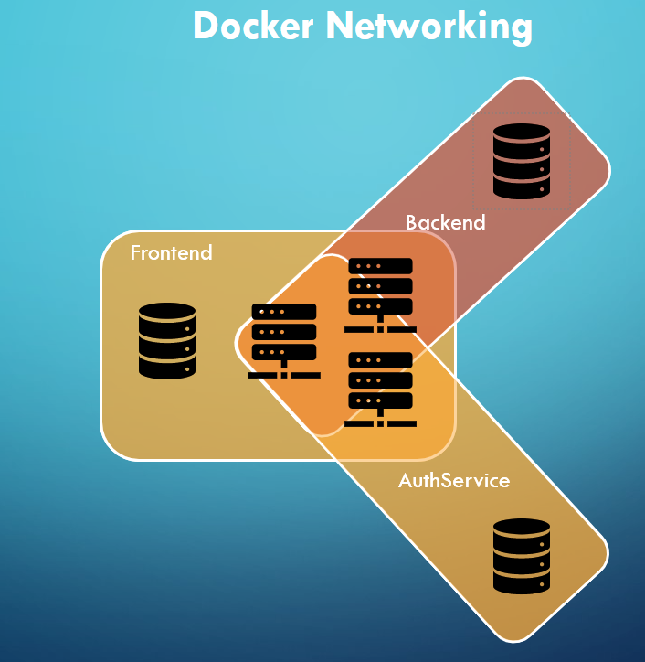

# SIMS System (Security Information Management System)

This README document provides an overview of the SIMS-System and its use. It contains classes of Employee, Issue, Manufactor and System. The classes contains porperties like EmployeeID, FirstName, LastName, IssueID, CVE, Description, ManufactorID, Name or SystemID and Hostname. These properties are automatically retrieved, created, deleted or modified by API calls using the entity framework in an SQL database.

## Features
-   Interface for data entry API (Nagios)
-   Entity Framework
-   Manual recording of security-relevant incidents (Processor, Notifier, Severity, Status, CVE, System, Description, Timestamp)
-   Escalation (higher level --> next user)
-   Notification per Web
-   Logging table (ID, Timestamp, Message)
-   Web-Frontend for enduser
    -   Recording of ystem security incidents
    -   View of systems, incidents and issuer
    -   Search function/sort function
    -   Export via CSV, Excel, PDF
-   JSON Web Token
-   User administration with authorisation assignment
-   Autofill of CVE-Description per NIST API per CVE-Number

## Docker Networking
To enforce network isolation and enhance security between the services, each database container is only allowed to talk to its corresponding interface. This ensures that each service can only access its designated database, creating a secure and controlled communication environment within the Dockerized application.

## Roadmap
-   Dynamic design selection of frontend per user selection
-   Implementation of graphical views (CVE scoring, incidents,affected systems)
-   First test phase for a specially developed AI
    -   Predict incident in relation to network topology and device types
-   Automated incident categorization based on severity
-   Language preferences for user profiles
-   API support for language-specific responses
-   Mention and comment system for incident communication
-   Integration with collaborative platforms like Slack and Microsoft Teams
-   Advanced reporting and analytics dashboard

## Prerequisites
-   Docker Container

## Contributing
Contributions to ISMS are welcome! If you find a bug or have an idea for a new feature, please let us know per mail ideaandbug@simspros.com. 

## Support
For any assistance go to FH St. Pölten in Austria and get in touch with us.

## Authors
Andreas Gastl (is221316)\
Mario Höflinger (is221331)\
Robert Spiesberger (is221308)\
Aichinger Stefan (is221306)

## Version 
The current Version is 0.0.1a

## License
Licensed under the [GPL](https://choosealicense.com/licenses/gpl-3.0/) License

## Datenbank Diagramm
